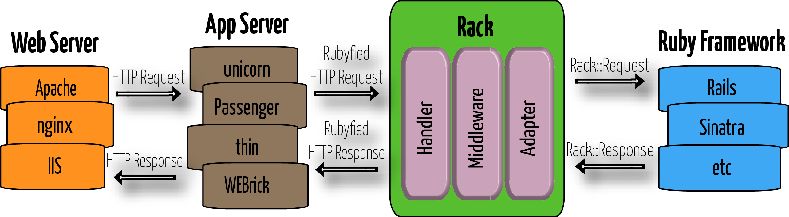

!SLIDE title
# Rack, Rails, & the Web


!SLIDE bullets
# Ruby + Web Recap

* The (production) stack:
    * Framework (Sinatra, Rails, etc.)
    * Rack
    * Ruby app server (unicorn, passenger, thin, etc.)
    * Web server (Apache, nginx, IIS, etc.) (provides the listener Socket)
* Generally, only work at one level.
    * If you're working at the framework level, don't need to work with Rack.


!SLIDE bullets
# Ruby + Web Recap (cont.)

* We (sort of) know:
    * Client sends HTTP request to web server.
        * HTTP request is just some text sent over a Socket.
    * Web server receives request.
    * Web server needs to get the request to our Ruby code.
    * Web server forwards request to Ruby app server.
    * Ruby app server extracts environment-y info and hands request to Rack.
    * Rack parses and hands to Rails.
* We'll talk more about Ruby web servers on [day 11](d11).

!SLIDE bullets
# Ruby + Web Recap (cont.)

* This is what that looks like:

    </img>

!SLIDE smbullets incremental
# Rack 'n Rail: <u>Server</u>

* First, "server" = thing that sends/receives the requests.
* Remember, we ran a server with Rack by doing:

    ```bash
    $ rackup config.ru
    ```
    * (notice how we didn't have all those other layers?)
* `rackup` just does `Rack::Server.start`.
    * (source [here](https://github.com/rack/rack/blob/master/bin/rackup))
* `Rack::Server` uses a `Rack::Handler` to hook in to a Ruby web server.
    * (Ruby web server handles the socket listening & sending.)
* `Rails::Server` inherits from `Rack::Server`.


!SLIDE bullets
# Rack 'n Rail: <u>Server</u> (cont.)

* Again:

    </img>

* For more, see Rails guides: ["Rails on Rack"](http://guides.rubyonrails.org/rails_on_rack.html)


!SLIDE incremental bullets
# Rack 'n Rail: <u>App</u>

* Remember, we used a `config.ru` to define a Rack app...
    * A Rack "app" just:
        * accepts 1 param, the Rack env
        * responds to `#call`
        * returns status, headers, body
* `Rails::Application` is a Rack-compliant app.
* Your app will inherit from `Rails::Application`.
    * Look at `config/application.rb` again...


!SLIDE incremental bullets
# Rack 'n Rail: <u>App</u> (cont.)

* Remember our multi-resource Rack app?

    ```ruby
    inspector = proc do |env|
      [200, { 'Content-Type' => 'text/html' }, [env.inspect]]
    end

    noper = proc do |env|
      [404, { 'Content-Type' => 'text/html' }, ['NEWP!!!']]
    end

    builder = Rack::Builder.new do
      map '/' do
        run inspector
      end

      map '/nope' do
        run noper
      end
    end

    run builder
    ```

!SLIDE incremental bullets
# Rack 'n Rail: App (cont.)

* Rails makes this nicer with routing...
    * Look at `config/routes.rb`...
* Remember talking about Sockets, CGI, Rack (by itself)...
    * Rails still does those things, you just don't see them.
* Remember Sinatra?

    ```ruby
    get '/nope' do
      status not_found
      body 'NEWP!!!'
    end
    ```
    * It's doing routing and business logic all together.
    * Rails route:

        ```ruby
        get 'nope' => 'nope#index'
        ```

!SLIDE bullets incremental
# Rack 'n Rail Summary

* You don't _have_ to know about Sockets, CGI, or Rack to do Rails.
    * It does all these things for you--thanks to Rack.
* Rails gives you access to all of your site's abilities with Ruby.
    * Not stuck doing (as much) OS setup stuff.
    * Spread across fewer tools to run your site.
* Different aspects of your app are separated by their responsibility.


!SLIDE questions center
# Questions?

